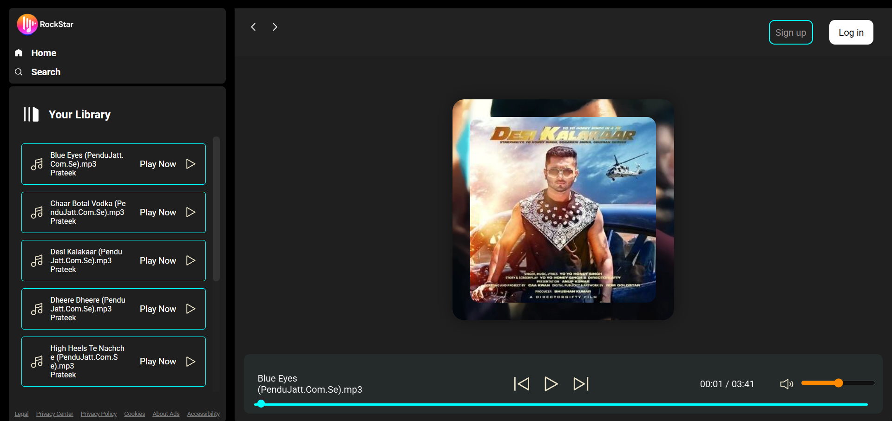

📝 Project Description - 

Rockstar Player is a sleek, offline-first music streaming web app designed to deliver a smooth and intuitive listening experience. Inspired by platforms like Spotify, it lets users browse through curated artist playlists, view album covers, and play high-quality MP3 songs—all from a beautiful, responsive interface. Built using only HTML, CSS, and vanilla JavaScript, the app includes a custom audio player with full controls like play, pause, seek, next/previous, and volume adjustment.

Unlike other music apps that rely on external services or APIs, Rockstar Player runs entirely in the browser using locally stored songs and images. Whether you're on desktop or mobile, the layout adapts to give you a consistent and modern user experience.

🌐 Open in your browser - 

You can directly open index.html:
start index.html

Or use a local server (recommended):
For Python 3
python -m http.server
Go to http://localhost:8000

👨‍🎤 Artists & Playlists - 

Each artist folder (e.g., diljit/, arijit/) contains:

Album cover image

4–5 MP3 tracks

Dynamically generated UI via JS

📦 To-Do (Coming Soon) - 

✅ Add mobile gesture controls

⏳ Create search and filter functionality

☁️ Integrate cloud playlist saving

🔀 Add shuffle and repeat modes

🙏 Credits - 

Designed and developed by Prateek

Inspired by Spotify, Gaana, Wynk

Album covers and MP3s are for educational/demo purposes only

## 📸 Screenshots

### 🏠 Homepage

### 🎧 Playlist Views

### 📱 Responsive Layout

